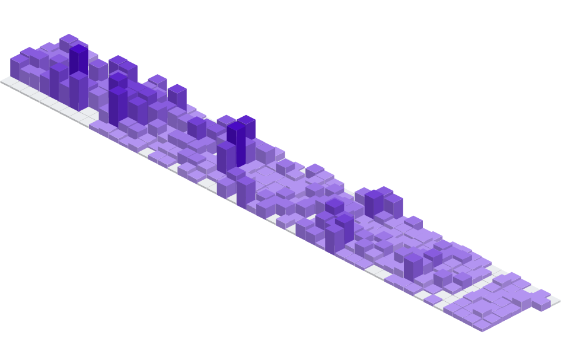

<h1 align="center">Hi 👋, I'm Loïc</h1>
<h3 align="center">I'm a computer science engineering sudent in Lille (France)</h3>

- 🔭 I’m currently working on [Space](https://github.com/PottierLoic/Space) (my own 2D/3D Engine).
- 🌱 I’m currently learning **OpenGL**.
- 🗣️ Spoken Language **French, English**. (Japanese soon -_-)
- 📝 Interested in **maths, fractals, emulation and physics simulations**.
- 📫 Reach me on **loic.pottier@live.fr** or on Discord: **voxinio**.

<h3 align="left">Languages and Tools:</h3>

  
  
  
  
  
  
  
  

<h3 align="left">Activities</h3>
